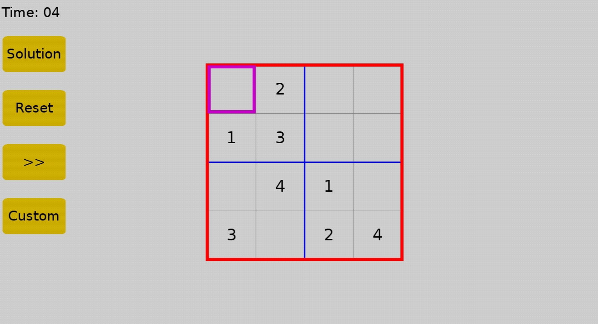
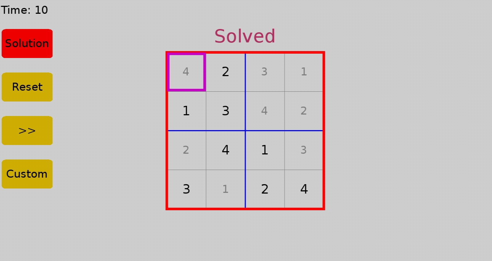

# Sudoku-GUI
## How to play Sudoku
The objective is to fill a 9x9 grid so that each column, each row, and each of the nine 3x3 boxes contains the digits from 1 to 9. 
Each number can only appear once in a row, column or 3×3 box.

## Project definition and features
A sudoku game where a user tries to fill the sudoku puzzle correctly, 
includes 9×9 and 4×4 grids... 
Enables input of custom boards to generate quick solutions for any external puzzles a user might have

## Project Screenshots
](#)
](#) 

](#)
](#)

## Running the game
-Ensure you have python 3 installed, 
-Ensure you have pygame module installed, to install 
 Type `pip install pygame` in the terminal or command prompt 
-Clone the project and run `sudokuGUI.py`, to run 
`python sudokuGUI.py`
